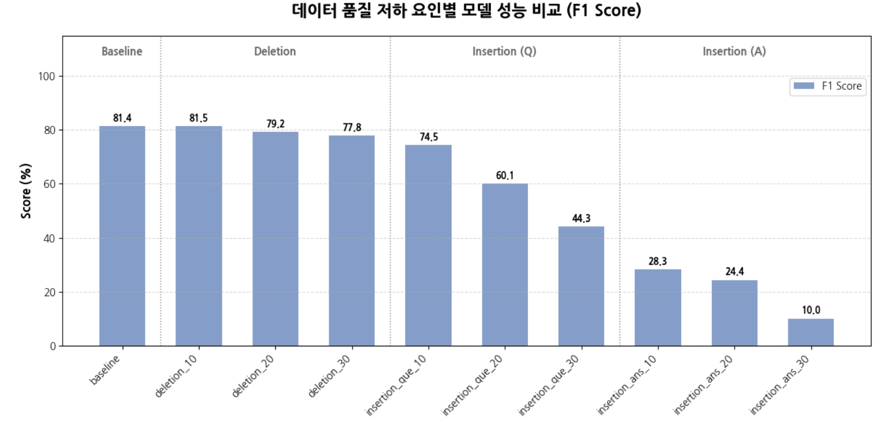
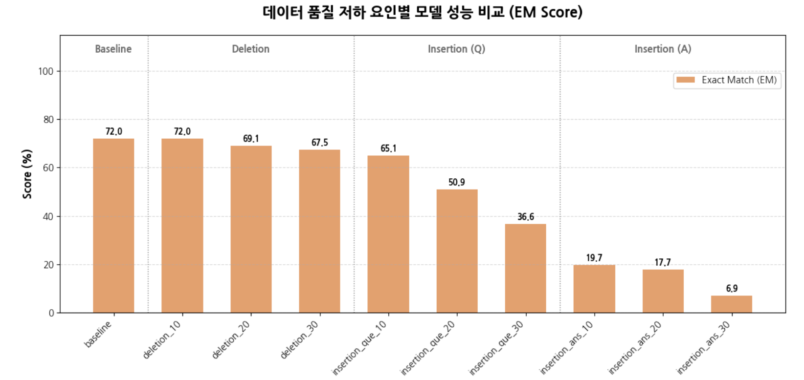
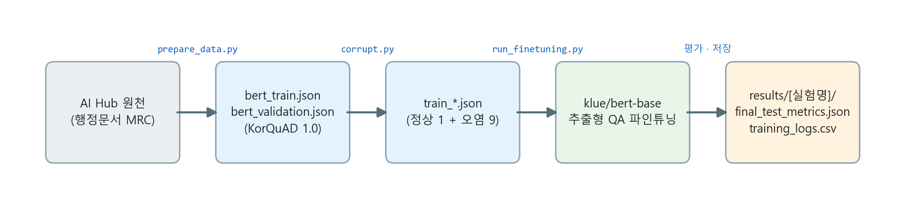
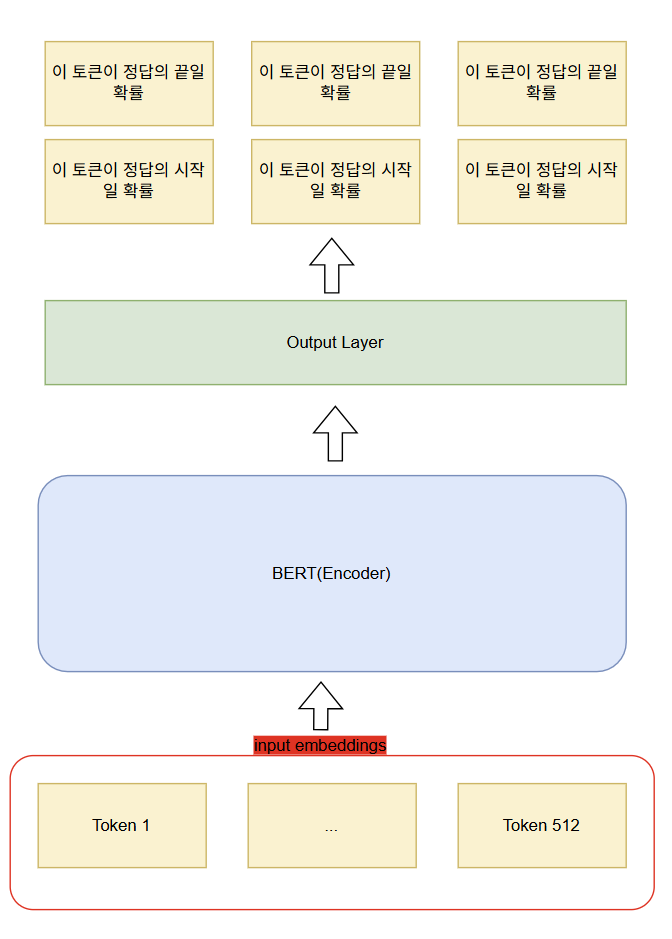
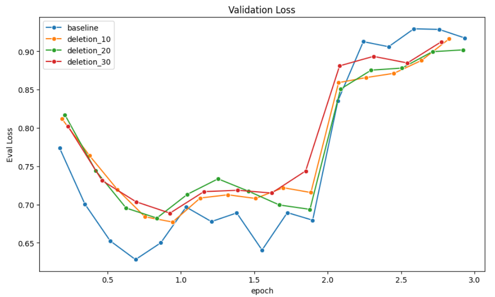
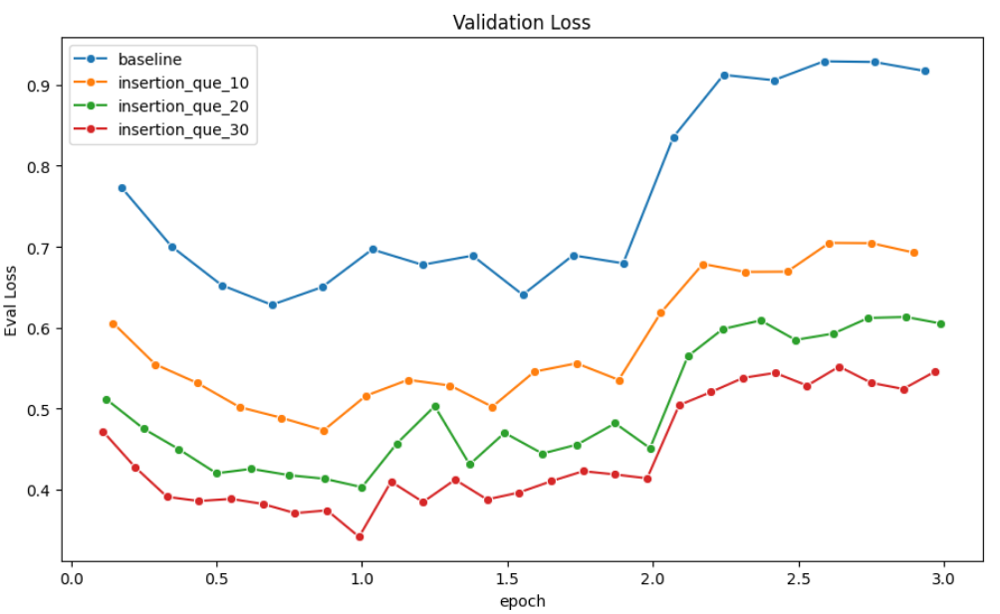
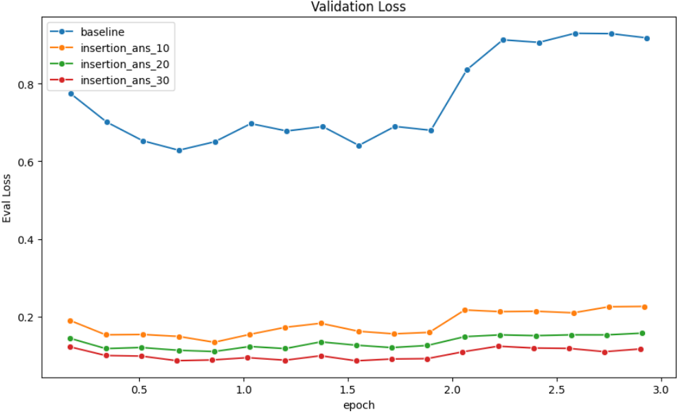
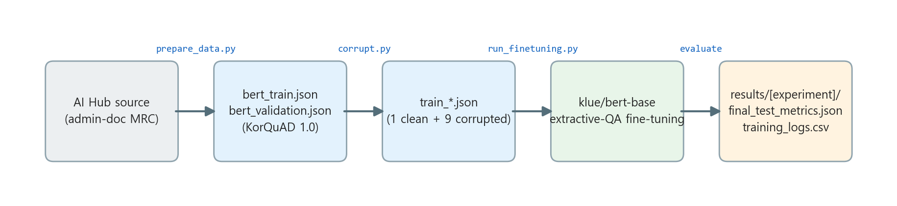

# 한국어 기계독해(MRC) 데이터 오염이 모델 성능에 미치는 영향

> **질문 - 지문 - 정답으로 이루어진 기계학습 데이터의 "어디에" 노이즈가 끼느냐에 따라 모델 붕괴 정도가 비대칭적으로 달라진다** 는 점을 정량적으로 규명한 데이터 중심(Data-centric) 실험이다.
> `klue/bert-base` 추출형 QA 모델을 정상 데이터와 3가지 유형 × 3단계 강도로 인위 오염한 데이터로 각각 파인튜닝하여 F1/EM 변화를 비교한다.


-2ea44f)

**언어 / Language: 한국어 (아래) · [English](#english)**

---

## 프로젝트 개요

대규모 한국어 학습 데이터를 단기간에 구축하는 과정에서는 삽입·삭제와 같은 휴먼 에러가 불가피하게 섞인다. 본 프로젝트는 데이터 품질 저하가 기계독해(QA) 모델 성능을 얼마나 떨어뜨리는지를, 오류의 발생 위치와 종류별로 분리하여 정량적으로 측정한다.

- **연구 내용**: AI Hub 행정문서 MRC 데이터를 KorQuAD 1.0 포맷으로 가공하고, 정상셋 1개와 오염셋 9개(3유형 × 10/20/30%)를 생성한 뒤, 동일한 하이퍼파라미터로 각각 `klue/bert-base`를 파인튜닝하여 동일한 검증셋에서 F1/EM을 비교한다.
- **실행 방법**: 모든 과정은 **`starter.sh` 하나**로 실행할 수 있다.
- **결과**: 실험별 결과는 [`results/<실험명>/`](results/) 아래 두 파일로 저장된다.
  - `final_test_metrics.json` — 최종 성능 지표 `{ "exact_match": EM, "f1": F1 }` (SQuAD 방식).
  - `training_logs.csv` — 스텝별 학습 곡선(loss, learning_rate, eval_loss 등 고정 스키마).
- **재현성**: 데이터(5.7GB)는 라이센스와 용량 문제로 저장소에 포함하지 않고 **재생성 레시피, 동봉 샘플, 실측 결과**로 대체한다. 
  `bash starter.sh sample`로 샘플 합성 데이터를 사용해 파이프라인 전 과정을 검증할 수 있다.

---

## 결과 요약



오염 30% 지점에서 정상군(Baseline, F1 81.4) 대비 하락폭은 **결측 −3.6%p, 지문 오염 −37.1%p, 정답 오염 −71.4%p** 로 극명하게 비대칭적이다.

| 기준선 (오염 X) | F1 | EM |
|:---:|:---:|:---:|
| **Baseline** | **81.41** | **71.99** |

| 오염 유형 | 10% (F1 / EM) | 20% (F1 / EM) | 30% (F1 / EM) |
|---|---|---|---|
| Deletion (데이터 결측) | 81.50 / 71.98<br>(+0.1% / ±0.0%) | 79.18 / 69.07<br>(−2.2% / −2.9%) | 77.85 / 67.48<br>(−3.6% / −4.5%) |
| Insertion-Que (구문 오염) | 74.53 / 65.06<br>(−6.9% / −6.9%) | 60.15 / 50.89<br>(−21.3% / −21.1%) | 44.29 / 36.65<br>(−37.1% / −35.3%) |
| Insertion-Ans (정답 오염) | 28.29 / 19.68<br>(−53.1% / −52.3%) | 24.35 / 17.71<br>(−57.1% / −54.3%) | 10.02 / 6.90<br>(−71.4% / −65.1%) |


<br>
<br>

<b>EM(Exact Match) Score</b>




> **결론** : **같은 양의 노이즈라도 "정보 밀도"가 높은 데이터일수록 오염에 치명적이다.** 정보 밀도가 높은 정답 라벨은 미세한 오염에도 붕괴하지만, 정보가 분산·중복된 지문은 30% 결측에도 견딘다. 그 결과 품질 저하의 치명도와 검수 우선순위는 **정답(라벨) > 질문(구문) > 지문(결측)** 순으로 나타난다.

---

## 실험 개요

NIA 데이터 품질관리 가이드라인은 유효성(저품질 데이터로 학습했을 때 성능이 실제로 저하되는지)을 핵심 지표로 제시한다. 그러나 검수 인력과 예산이 한정된 환경에서 어떤 종류의 오류에 자원을 먼저 투입해야 하는가에 대한 정량적 근거는 부족하다. 본 연구는 질문–지문–정답 구조의 MRC 태스크에서 오류 발생 위치별 영향을 통제 실험으로 측정한다.

한국어 텍스트 입력 오류의 대부분은 편집 거리 1 이내의 단순 오타에서 비롯되며, 크게 **삽입(Insertion)·삭제(Deletion)·대치(Substitution)** 세 유형으로 분류된다. 특히 BERT 계열이 사용하는 서브워드 토크나이저는 오탈자가 섞인 단어를 원래 의미 단위로 분해하지 못하고 개별 문자나 `[UNK]` 토큰으로 분절한다. 따라서 오류가 빈번할 경우 **모델이 학습해야 할 목표 자체가 왜곡된다.** 본 연구는 이 가운데 현장에서 가장 빈번한 **삽입·삭제** 오류가 발생 위치(지문 또는 정답)에 따라 성능에 미치는 영향이 어떻게 달라지는지에 집중한다.

<br>

### 3가지 품질 저하 요인
| 요인 | 코드 태그 | 오염 방식 | 예시 (정답 = `관할 지방자치단체장`) |
|---|---|---|---|
| **데이터 결측률** | `deletion` | 정답 스팬을 제외한 지문 토큰의 n%를 무작위 삭제 | `생활폐기물은 관할 지방자치단체장이 처리한다.` → `은 관할 지방자치단체장이 처리한다.` |
| **구문 정확성 저하** | `insertion_que` | 정답 외 지문 텍스트 사이에 특수문자(`!@#$%^&*`) 삽입 | `생@활폐기%물은 관할 지방자치단체장이 처리한다.` |
| **라벨링 정확성 저하** | `insertion_ans` | **정답 텍스트 자체**에 특수문자 삽입 (학습 목표 왜곡) | 정답 → `관!할 지방자@치단체장` |

각 요인을 10/20/30% 강도로 적용하여 오염군 9개와 정상군 1개, 즉 **총 10개의 데이터셋**을 구성하였다. 검증셋은 오염되지 않은 상태로 고정하여 공정한 비교가 가능하도록 하였다.

---

## 실험 설계



**모델 구조** — `[CLS] 질문 [SEP] 지문 [SEP]` 형태로 결합한 시퀀스를 BERT 인코더에 통과시키면, 출력층이 지문의 각 토큰이 정답의 **시작/끝 위치일 확률**을 산출한다. 학습에는 Cross-Entropy Loss를 사용한다.
모델은 klue-BERT 모델을 그대로 가져와 별도의 프리트레인 사용한다.

<p align="center"></p>

- **데이터**: AI Hub [행정 문서 대상 기계독해 데이터](https://aihub.or.kr/aihubdata/data/view.do?dataSetSn=569) 를 KorQuAD 1.0 포맷으로 가공하였다. 학습 **197,698** / 검증 **37,042** QA 쌍이다.
- **모델**: `klue/bert-base`에 선형 출력층(정답 시작/끝 위치 예측)을 결합하였으며, 토크나이저는 `BertTokenizerFast`(WordPiece)를 사용하였다.
- **평가 지표**: SQuAD **F1**(토큰 단위 중첩 = 문맥 이해)과 **EM**(완전 일치 = 정확 추출)을 사용한다.
- **학습 하이퍼파라미터** (전 실험 동일):

  | 항목 | 값 | 항목 | 값 |
  |---|---|---|---|
  | Optimizer | AdamW (weight decay 0.01) | Epochs | 3 |
  | Learning rate | 3e-5 | Max length / stride | 384 / 128 |
  | Batch size | 16 | Precision | Mixed Precision (FP16) |

- **실험 환경(원 실험)**: NVIDIA RTX A6000 (48GB) 및 AMD Radeon RX 9070xt (ROCm) / Ubuntu 22.04, RHEL 9.6 / PyTorch 2.x + HuggingFace Transformers.

---

## 결과 분석

**1. 데이터 결측률: 노이즈에 강건함 (F1 −3.6%p @30%)**
정답 토큰이 보존되는 한, 지문 정보의 30%가 사라지더라도 모델은 남은 문맥을 활용하여 충분히 정답을 도출하였다. 이는 기계독해 지문의 **정보 중복성**이 결측을 흡수함을 보여준다.



**2. 구문 정확성 저하: 예상을 상회한 성능 저하 (F1 −37.1%p @30%)**
"BERT는 MLM 사전학습을 통해 노이즈에 강건할 것"이라는 가설을 정면으로 반증하는 결과이다. 주된 원인은 서브워드 토크나이저의 구조적 취약점에 있다. 질문의 `지방자치단체`에 특수문자가 삽입되어 `지방#자&치단@체`로 변형되면, `[지방]+[자치]+[단체]`라는 의미 단위가 파괴되어 파편화(fragmentation)된다. 오염도가 높아질수록 성능 하락은 더욱 가팔라진다.



**3. 라벨링 정확성 저하: 회복 불가능한 붕괴 (F1 −71.4%p @30%)**
세 요인 중 가장 파괴적이다. 10% 오염만으로 F1이 81.4에서 28.3으로 급락하고, 30%에서는 10.0까지 떨어져 사실상 모델로서의 기능을 상실한다. 입력(지문·질문) 노이즈는 정답 탐색을 어렵게 할 뿐 정답 자체는 유효하지만, **정답 라벨의 오염은 모델이 학습해야 할 목표 자체를 왜곡시켜** 학습 방향을 근본적으로 파괴한다.



> **주목할 점**: `insertion_ans`는 검증 **loss가 가장 낮음에도**(오염된 정답 라벨에 그대로 과적합) F1/EM은 붕괴한다. 낮은 loss가 모델의 실질적 무력화를 가린다는, 라벨 오염의 위험성을 단적으로 보여주는 현상이다.

> ### 결론: 정보 밀도와 노이즈 민감도
> **정보 밀도가 높은 데이터일수록 노이즈에 치명적이다.** 짧지만 핵심이 압축된 정답 라벨은 미세한 오염만으로 학습 목표가 붕괴하는 반면, 정보가 분산·중복된 지문은 30% 결측에도 견딘다. 즉, 모델 성능을 좌우하는 것은 노이즈의 "양"이 아니라 노이즈가 위치한 지점의 "정보 밀도"이다.

> 자세한 서론·이론적 배경·전체 분석과 더 자세한 내용은 [reports.pdf](reports.pdf)를 참고하라.

---

## 시사점: 검수 인력 투입 우선순위

본 실험은 **노이즈가 모델에 미치는 영향이 데이터 유형별로 비대칭적**임을 보여준다. 따라서 모든 데이터에 동일한 품질 관리 방법을 적용하는 것은 비효율적이며, 한정된 인력과 예산은 **민감도가 높은 영역에 집중 투입**할 때 ROI(Return on Investment)가 극대화된다. 검수 우선순위는 다음과 같다.

| 우선순위 | 데이터 유형 | 노이즈 민감도 | 근거(실험 결과) | 권장 검수 전략 |
|:---:|---|---|---|---|
| **1 (최우선)** | **정답 라벨** | 극도로 높음 | 10% 오염만으로 F1 81.4 → **28.3**, 30%에서 **10.0** | **사람에 의한 전수 검증** — 정답은 길이가 짧지만 핵심 정보가 압축된 학습 목표(Ground Truth)이므로, 오류가 학습 자체를 파괴한다 |
| **2** | **질문** | 높음 | 구문 오염 시 F1 **−37.1%p** (30%) | **문법 정합성 자동 전처리 파이프라인** — 편집거리 1의 미세 오류도 토크나이저가 핵심 키워드를 분리하여 문맥 연결고리를 끊는다 |
| **3** | **지문** | 낮음 | 30% 결측에도 F1 **−3.6%p** | **샘플링·알고리즘 기반 검수** — 정보 중복성이 높아 일부 손실에 둔감하므로 전수 조사는 비용 낭비이다 |

**요약**: `정답(Label) > 질문(Question) > 지문(Context)` 순으로 검증 자원을 차등 배분한다. 정답에는 고강도 전수 검증을, 질문에는 자동화된 정제를, 지문에는 유연한 표본 검수를 적용하는 **선택과 집중 전략**이 데이터 구축 예산의 낭비를 방지하면서 실질적 성능을 담보한다.

---

## 설치 및 환경 구축

```bash
git clone <repository-url>
cd LLM_QA

pip install -r requirements.txt
```

> **torch 주의**: 원 실험은 9070xt를 활용한 Linux / AMD ROCm 환경에서 수행하였다. `requirements.txt` 의 `torch>=2.1` 은 플랫폼 독립 표기이므로, 사용 중인 가속기(CUDA/ROCm/CPU)에 맞는 빌드를 [pytorch.org](https://pytorch.org/get-started/locally/) 안내에 따라 설치한다. requirements.txt에는 코드가 실제로 사용하는 패키지만 정리되어 있다.

---

## 데이터 준비 (AI Hub)

학습/검증 데이터는 **재배포가 제한**되고, 전체 약 **5.7GB**(10개 파일이 100MB 초과)로 GitHub 단일 파일 한도에도 걸린다. 따라서 저장소에 포함하지 않고 **원천에서 재생성**한다. (데이터 없이 파이프라인만 확인하려면 `bash starter.sh sample`)

**1) 원천 내려받기** — AI Hub [행정 문서 대상 기계독해 데이터](https://aihub.or.kr/aihubdata/data/view.do?dataSetSn=569) (회원가입·이용 신청 필요, 라이선스는 AI Hub 정책을 따른다).

**2) 압축 해제 및 배치** — 다운로드 파일 중 **추출형 QA에 해당하는 `span_extraction` 라벨링데이터**의 압축을 직접 풀어, 그 안의 `.json` 파일을 아래 폴더 **바로 아래에 평탄하게**(하위 폴더 없이) 둔다.

- 학습용 `TL_span_extraction`(라벨링데이터)의 `.json` → `datasets/raw/1.Training/`
- 검증용 `VL_span_extraction`(라벨링데이터)의 `.json` → `datasets/raw/2.Validation/`

```
datasets/raw/
├── 1.Training/     # TL_span_extraction 의 .json (폴더 바로 아래 배치)
└── 2.Validation/   # VL_span_extraction 의 .json (폴더 바로 아래 배치)
```

> ⚠️ **주의** — `prepare_data.py` 는 각 폴더의 `*.json` 을 **비재귀**로 읽는다.
> ① `.json` 은 반드시 폴더 **바로 아래**에 두어야 한다(라벨링데이터 하위 폴더째 두면 0개로 인식되어 조용히 실패).
> ② 본 실험은 추출형 QA이므로 `multiple_choice`·`tableqa`·`text_entailment`·`unanswerable` 등 **다른 태스크는 넣지 않는다**(스키마가 달라 변환 실패).

**3) 재생성** — `bash starter.sh full` 이 데이터가 없으면 아래 변환·오염 단계를 자동 수행한다 (수동 절차는 아래 [단계별 수동 실행](#단계별-수동-실행) 참고).

재생성되는 파일 (모두 `.gitignore` 처리):

| 파일 | 설명 | 대략 용량 |
|---|---|---|
| `bert_train.json` | KorQuAD 포맷 정상 학습셋 | ~0.6 GB |
| `bert_validation.json` | 검증셋(오염하지 않음) | ~74 MB |
| `train_baseline.json` | 대조군(오염 없음) | ~0.6 GB |
| `train_deletion_{10,20,30}.json` | 데이터 결측률 오염 | 0.46–0.55 GB |
| `train_insertion_que_{10,20,30}.json` | 구문 정확성 저하(지문 오염) | 0.61–0.65 GB |
| `train_insertion_ans_{10,20,30}.json` | 라벨링 정확성 저하(정답 오염) | ~0.59 GB |

> 데이터 규모: 학습 **197,698** / 검증 **37,042** QA 쌍.

---

## 전체 재현 절차

```bash
# 1) 가상환경 생성 및 활성화
conda create -n llm_qa python=3.10 -y
conda activate llm_qa

# 2) 의존성 설치 (+ 가속기에 맞는 torch)
pip install -r requirements.txt
# 예) CUDA 12.1: pip install torch --index-url https://download.pytorch.org/whl/cu121

# 3-A) 데이터 없이 빠른 재현 — 동봉 샘플로 전 과정 검증 (GPU 불필요, 수 분)
bash starter.sh sample
#     → 결과: results/sample/<실험명>/

# 3-B) 본 실험 전체 재현 — 실제 데이터 필요
#     위 '데이터 준비' 섹션에 따라 span_extraction 데이터를 datasets/raw/{1.Training,2.Validation}/ 에 배치한 뒤:
bash starter.sh full
#     → 결과: results/<실험명>/

# 4) 결과 확인
cat results/baseline/final_test_metrics.json        # F1 / EM
head results/baseline/training_logs.csv             # 학습 곡선
```

`starter.sh` 는 데이터가 없으면 준비·오염 단계를 자동으로 수행하고, 이미 완료된 실험은 건너뛰며, 중단된 경우 마지막 체크포인트부터 재개한다.

### 단계별 수동 실행

```bash
python src/prepare_data.py --raw_dir datasets/raw --out_dir datasets        # 원천 → KorQuAD
python src/corrupt.py      --input  datasets/bert_train.json --out_dir datasets  # 오염 10종 생성(시드 고정)
python src/run_finetuning.py --experiment_name baseline \
    --train_file datasets/train_baseline.json --output_root results          # 단일 실험
```

---

## 저장소 구조 및 파일 설명

```
.
├── starter.sh                  # [진입점] 전체 파이프라인 오케스트레이션 (sample / full)
├── requirements.txt            # 최소 의존성 (실제 사용 패키지만)
├── src/
│   ├── prepare_data.py         # AI Hub 원천 → KorQuAD 1.0 변환 (정답 위치 인덱싱)
│   ├── corrupt.py              # 정상셋 → 오염 10종 생성 (시드 고정, 재현 가능)
│   └── run_finetuning.py       # 파인튜닝 + 평가(F1/EM) + 고정 스키마 CSV 로깅
├── notebooks/                  # 탐색용 노트북(.ipynb) + 셀 단위 .py 내보내기
│   ├── 1_preprocessing.ipynb / .py
│   └── 2_corrupter.ipynb / .py
├── datasets/
│   └── sample/raw/             # 동봉 소량 샘플 (스모크 테스트 입력)
├── results/                    # [결과] 10개 실험의 지표/학습로그 (커밋됨)
│   └── <실험명>/{final_test_metrics.json, training_logs.csv}
├── assets/                     # README용 결과 그래프·아키텍처 이미지
└── reports             # 최종 보고서 전문
```

| 파일 / 경로 | 역할 |
|---|---|
| **`starter.sh`** | **진입점.** 데이터 준비 → 오염 생성 → 10개 실험 학습/평가를 순차 실행한다. `sample`/`full` 모드를 지원한다 |
| `requirements.txt` | 코드가 실제 import하는 패키지만 정리 (torch, transformers, datasets, evaluate, numpy + accelerate, 노트북용 pandas·tqdm) |
| `src/prepare_data.py` | 원천 JSON 병합 및 정답의 본문 내 위치(`answer_start`) 탐색 → `datasets/bert_train.json`, `bert_validation.json` 생성 |
| `src/corrupt.py` | 정상 학습셋에서 `deletion`/`insertion_que`/`insertion_ans` × 10/20/30% 오염셋과 baseline 생성 → `datasets/train_*.json` (10개) |
| `src/run_finetuning.py` | 단일 실험의 학습·평가 통합. 체크포인트 자동 재개, 완료 시 스킵, 실시간 CSV 로깅, 최종 F1/EM 저장 |
| `notebooks/*.ipynb` | 전처리·오염 과정을 단계별로 보여주는 탐색용 노트북 |
| `notebooks/*.py` | 위 노트북을 `# %%` 셀 단위로 실행 가능한 스크립트로 내보낸 버전 |
| `datasets/sample/raw/` | 데이터 없이 파이프라인을 검증할 수 있는 소량(KorQuAD 원천 포맷) 샘플 |
| **`results/<실험명>/final_test_metrics.json`** | **실험 최종 지표**: `{"exact_match": EM, "f1": F1}` (검증셋 기준) |
| **`results/<실험명>/training_logs.csv`** | **스텝별 학습 곡선**: `loss, grad_norm, learning_rate, epoch, step, eval_loss, train_runtime, …` |
| `assets/` | README에 삽입된 결과 그래프(F1/EM, Validation Loss)와 모델 아키텍처 이미지 |
| `실험 설계.hwpx` / `최종 보고서.hwpx` | 실험 설계·최종 보고서 원문 |

> 실험명(`<실험명>`)은 `baseline`, `deletion_{10,20,30}`, `insertion_que_{10,20,30}`, `insertion_ans_{10,20,30}` 의 총 10개이다.

---

## 하이라이트

- **단일 진입점** — 전체 데이터를 Ai Hub에서 가져와 전처리하고 파인튜닝하는 통합 파이프라인을 `starter.sh` 하나로 구성하여 데이터 준비·오염·10개 실험을 순차 수행한다.
- **재현성** — 오염 생성 시드 고정, 의존성 최소화, 데이터 없이도 동작하는 샘플 스모크 테스트를 제공한다.
- **재실행** — 완료된 실험(`final_test_metrics.json` 존재)은 자동 스킵하며, 중단 시 마지막 체크포인트에서 자동 재개한다.
- **견고한 로깅** — 학습/평가/요약 행을 고정 컬럼 스키마 CSV로 실시간 기록하여 중단되어도 직전까지 보존되며, 별도의 복구 단계가 필요 없다.
- **데이터 거버넌스** — 재배포 제한 데이터를 "재생성 레시피 + 결과물"로 대체하여 라이선스와 용량 문제를 동시에 해결한다.
- **충돌 방지** — 샘플 실행 결과는 실제 `results/` 와 이름이 겹치는 경우 `results/sample/` 로 자동 분리 저장한다.
---

## 한계 및 향후 연구

- 단일 모델(`klue/bert-base`)·단일 태스크(MRC)에 국한된 결과이므로, 생성형 모델(GPT/LLaMA)·타 NLP 과제로의 일반화는 추가 검증이 필요하다.
- 무작위 특수문자 삽입/삭제는 실제 휴먼 에러를 단순화한 합성 노이즈이므로, 보다 현실적인 오류 모델링이 요구된다.
- 각 요인을 독립적으로 통제하였으므로, 다중 오류가 동시에 발생할 때의 **상호작용 효과**는 후속 과제로 남는다.

---

## 데이터 출처 및 라이선스

- 데이터: AI Hub [행정 문서 대상 기계독해 데이터](https://aihub.or.kr/aihubdata/data/view.do?dataSetSn=569). 데이터 이용은 AI Hub 정책을 따르며, 본 저장소는 원천 데이터를 재배포하지 않는다.
- 코드: 자유롭게 참고·재사용 가능하다(MIT)

<br/>

---
---

<a id="english"></a>

# Impact of Training-Data Corruption on Korean MRC (Extractive QA)

> A data-centric study quantifying how the **location** of noise in question–context–answer training data asymmetrically determines model collapse.
> A `klue/bert-base` extractive-QA model is fine-tuned separately on clean data and on data artificially corrupted in **3 types × 3 intensities**, then compared by F1/EM.

**Language: [한국어 (top)](#한국어-기계독해mrc-데이터-오염이-모델-성능에-미치는-영향) · English (below)**

## Project Overview

Building large-scale Korean training data on a tight schedule inevitably introduces human errors such as insertion and deletion. This project **measures how much data-quality degradation harms a machine-reading-comprehension (QA) model, separated by the location and type of the error.**

- **Scope**: Process AI Hub administrative-document MRC data into KorQuAD 1.0 format, generate 1 clean set and 9 corrupted sets (3 types × 10/20/30%), fine-tune `klue/bert-base` on each with identical hyperparameters, and compare F1/EM on the same validation set.
- **How to run**: The entire process runs from a **single `starter.sh`**.
- **Results**: Each experiment's results are saved under [`results/<experiment>/`](results/) as two files.
  - `final_test_metrics.json` — final metrics `{ "exact_match": EM, "f1": F1 }` (SQuAD-style).
  - `training_logs.csv` — per-step training curve (fixed schema: loss, learning_rate, eval_loss, …).
- **Reproducibility**: The dataset (5.7 GB) is not committed (licensing and size); it is replaced by a **regeneration recipe, a bundled sample, and the measured results**. `bash starter.sh sample` runs the whole pipeline on synthetic sample data, without the real dataset.

## Results Summary


At 30% corruption, the drop versus Baseline (F1 81.4) is starkly **asymmetric**: deletion −3.6 pp, context noise −37.1 pp, answer-label noise −71.4 pp.

**Reference — Baseline (no corruption): F1 81.41 / EM 71.99**

| Corruption type | 10% (F1 / EM) | 20% (F1 / EM) | 30% (F1 / EM) |
|---|---|---|---|
| Deletion (missing info) | 81.50 / 71.98<br>(+0.1% / ±0.0%) | 79.18 / 69.07<br>(−2.2% / −2.9%) | 77.85 / 67.48<br>(−3.6% / −4.5%) |
| Insertion-Que (context noise) | 74.53 / 65.06<br>(−6.9% / −6.9%) | 60.15 / 50.89<br>(−21.3% / −21.1%) | 44.29 / 36.65<br>(−37.1% / −35.3%) |
| Insertion-Ans (answer-label noise) | 28.29 / 19.68<br>(−53.1% / −52.3%) | 24.35 / 17.71<br>(−57.1% / −54.3%) | 10.02 / 6.90<br>(−71.4% / −65.1%) |

<br>
<br>

<b>EM (Exact Match) Score</b>


> **In short** — for a given amount of noise, the higher the **information density**, the more fatal it is. The compressed **answer label** collapses under the slightest corruption, while the dispersed, redundant **context** survives even 30% deletion. Hence the severity of degradation — and the review priority — runs **Answer (label) > Question (syntax) > Context (deletion)**.

## Experiment Overview

Korea's NIA data-quality guideline lists **validity** (whether performance actually drops when training on low-quality data) as a core metric, yet there is little quantitative basis for **which kind of error should receive review resources first** under limited manpower and budget. This study measures, through controlled experiments, the impact by **error location** in the question–context–answer MRC structure.

Most Korean text-input errors stem from simple typos within edit distance 1, broadly classified into **insertion, deletion, and substitution**. The subword tokenizers used by BERT-family models cannot split a typo-laden word into its intended units and instead break it into individual characters or `[UNK]` tokens; consequently, frequent errors **distort the learning target itself**. This study focuses on **insertion and deletion** — the most common in practice — and on how their **location** (context vs. answer) changes the impact.

**Research questions**
1. How much does missing information in the context affect the model's contextual understanding?
2. Is BERT's pretraining-based robustness to context typos actually effective?
3. How much degradation does mis-tokenization from answer-label corruption cause?
4. Based on the above, how should data-review priorities be set?

### The three quality-degradation factors

| Factor | Code tag | Corruption method | Example (answer = `관할 지방자치단체장`) |
|---|---|---|---|
| **Missing-info rate** | `deletion` | Randomly delete n% of context tokens excluding the answer span | `생활폐기물은 관할 지방자치단체장이 처리한다.` → `은 관할 지방자치단체장이 처리한다.` |
| **Syntactic accuracy** | `insertion_que` | Insert special chars (`!@#$%^&*`) into non-answer context text | `생@활폐기%물은 관할 지방자치단체장이 처리한다.` |
| **Labeling accuracy** | `insertion_ans` | Insert special chars **into the answer text itself** (distorts the target) | answer → `관!할 지방자@치단체장` |

Each factor is applied at 10/20/30% intensity, yielding 9 corrupted and 1 clean set, i.e. **10 datasets in total**; the validation set is kept clean for fair comparison.

## Experimental Design



**Model architecture** — the `[CLS] Question [SEP] Context [SEP]` sequence passes through the BERT encoder; the output layer predicts each context token's probability of being the answer **start / end** position, trained with Cross-Entropy loss.
The model uses klue-BERT directly, with no additional pretraining.

<p align="center"></p>

- **Data**: AI Hub [administrative-document MRC dataset](https://aihub.or.kr/aihubdata/data/view.do?dataSetSn=569), processed into KorQuAD 1.0. **197,698** train / **37,042** validation QA pairs.
- **Model**: `klue/bert-base` encoder with a linear head (answer start/end position); the tokenizer is `BertTokenizerFast` (WordPiece).
- **Metrics**: SQuAD **F1** (token overlap = contextual understanding) and **EM** (exact match = precise extraction).
- **Hyperparameters** (identical across all runs):

  | Item | Value | Item | Value |
  |---|---|---|---|
  | Optimizer | AdamW (weight decay 0.01) | Epochs | 3 |
  | Learning rate | 3e-5 | Max length / stride | 384 / 128 |
  | Batch size | 16 | Precision | Mixed Precision (FP16) |

- **Environment (original run)**: NVIDIA RTX A6000 (48GB) and AMD Radeon RX 9070xt (ROCm) / Ubuntu 22.04, RHEL 9.6 / PyTorch 2.x + HuggingFace Transformers.

## Results & Analysis

**1. Missing-info rate: robust (F1 −3.6 pp @30%).**
As long as the answer tokens are preserved, the model derives the answer from the remaining context even when 30% of the context is gone. This demonstrates that the **information redundancy** of MRC passages absorbs the loss.


**2. Syntactic accuracy: more damaging than expected (F1 −37.1 pp @30%).**
This directly **disproves** the hypothesis that "BERT is robust to noise thanks to MLM pretraining." The principal cause lies in the structural weakness of subword tokenizers: when special characters are injected into a question keyword (`지방자치단체` → `지방#자&치단@체`), the meaningful units `[지방]+[자치]+[단체]` are destroyed into fragments. The drop steepens as intensity rises.


**3. Labeling accuracy: irrecoverable collapse (F1 −71.4 pp @30%).**
This is the most destructive of the three. **Just 10% corruption reduces F1 from 81.4 to 28.3**, and 30% reaches 10.0 — the model effectively ceases to function. Input (context/question) noise only makes the answer harder to find while the answer itself remains valid, but **answer-label corruption turns the learning target itself into a meaningless token sequence**, fundamentally destroying the training direction.


> **Note**: `insertion_ans` shows the **lowest** validation loss (it overfits the corrupted answer labels) yet collapses on F1/EM — a vivid illustration that a low loss can mask a model that is, in fact, non-functional.

> ### Conclusion: information density and noise sensitivity
> **The higher a datum's information density, the more fatal noise is.** The short, information-dense **answer label** collapses under the slightest corruption, whereas the dispersed, redundant **context** withstands even 30% deletion. What governs performance is not the *amount* of noise but the *information density* at the point where the noise lands.

> For the full background, theory, and complete analysis, see [reports.pdf](reports.pdf).

## Implications: Data-Review Priority

The experiment shows that **noise affects the model asymmetrically by data type**. Applying uniform quality control to all data is therefore inefficient; limited manpower and budget should be **concentrated on high-sensitivity areas** to maximize ROI (return on investment). The review priority is as follows.

| Priority | Data type | Noise sensitivity | Evidence (results) | Recommended review strategy |
|:---:|---|---|---|---|
| **1 (highest)** | **Answer label** | Extremely high | 10% noise → F1 81.4 → **28.3**; 30% → **10.0** | **Full human verification** — answers are short but constitute the compressed Ground Truth, so errors corrupt the learning process itself |
| **2** | **Question** | High | Syntactic noise → F1 **−37.1 pp** (30%) | **Automated grammar-validation pipeline** — even edit-distance-1 errors split key tokens and sever the contextual link |
| **3** | **Context** | Low | 30% deletion → F1 only **−3.6 pp** | **Sampling / algorithmic review** — high redundancy makes it insensitive to partial loss, so exhaustive inspection would be wasteful |

**Summary**: Allocate review resources in the order `Answer (label) > Question > Context`. A **"select-and-focus" strategy** — intensive full verification for answers, automated cleaning for questions, and flexible sampling for contexts — prevents wasted budget while securing tangible performance gains.

## Installation & Environment Setup

```bash
git clone <repository-url>
cd LLM_QA

pip install -r requirements.txt
```

> **Note on torch**: the original experiments ran on Linux / AMD ROCm (Radeon RX 9070xt). `torch>=2.1` in `requirements.txt` is a platform-independent placeholder — install the build matching your accelerator (CUDA/ROCm/CPU) per [pytorch.org](https://pytorch.org/get-started/locally/). Dependencies are trimmed to only what the code actually uses.

## Data Preparation (AI Hub)

The train/validation data is derived from an AI Hub source, so **redistribution is restricted**; it is also ~**5.7 GB** in total (10 files exceed 100 MB), hitting GitHub's per-file limit. It is therefore **not committed** and is **regenerated from the source** instead. (To check the pipeline without any data, run `bash starter.sh sample`.)

**1) Download the source** — AI Hub [administrative-document MRC dataset](https://aihub.or.kr/aihubdata/data/view.do?dataSetSn=569) (sign-up / request required; usage follows AI Hub policy).

**2) Unzip & place** — from the download, unzip **only the `span_extraction` labeling data** (the extractive-QA task) and put its `.json` files **directly (flat)** under each folder — no subfolders.

- `.json` from `TL_span_extraction` (training labeling data) → `datasets/raw/1.Training/`
- `.json` from `VL_span_extraction` (validation labeling data) → `datasets/raw/2.Validation/`

```
datasets/raw/
├── 1.Training/     # .json from TL_span_extraction (flat, directly under the folder)
└── 2.Validation/   # .json from VL_span_extraction (flat, directly under the folder)
```

> ⚠️ **Note** — `prepare_data.py` reads `*.json` in each folder **non-recursively**.
> ① `.json` must sit **directly** under the folder (leaving them inside a labeling-data subfolder yields 0 files and silently fails).
> ② This is extractive QA, so do **not** include other tasks (`multiple_choice`, `tableqa`, `text_entailment`, `unanswerable`) — their schema differs and conversion fails.

**3) Regenerate** — `bash starter.sh full` runs the conversion/corruption steps automatically when data is missing (for manual steps, see [Manual step-by-step](#manual-step-by-step) below).

Regenerated files (all `.gitignore`d):

| File | Description | Approx. size |
|---|---|---|
| `bert_train.json` | Clean train set (KorQuAD format) | ~0.6 GB |
| `bert_validation.json` | Validation set (not corrupted) | ~74 MB |
| `train_baseline.json` | Control group (no corruption) | ~0.6 GB |
| `train_deletion_{10,20,30}.json` | Missing-info corruption | 0.46–0.55 GB |
| `train_insertion_que_{10,20,30}.json` | Syntactic-accuracy degradation (context noise) | 0.61–0.65 GB |
| `train_insertion_ans_{10,20,30}.json` | Labeling-accuracy degradation (answer noise) | ~0.59 GB |

> Data scale: **197,698** train / **37,042** validation QA pairs.

---

## Full Reproduction

Follow this end-to-end to reproduce identical results.

```bash
# 1) Create and activate the environment
conda create -n llm_qa python=3.10 -y
conda activate llm_qa

# 2) Install dependencies (+ accelerator-matched torch)
pip install -r requirements.txt
# e.g. CUDA 12.1: pip install torch --index-url https://download.pytorch.org/whl/cu121

# 3-A) Quick reproduction without data — validate the entire pipeline on the bundled sample (no GPU, minutes)
bash starter.sh sample
#      -> results: results/sample/<experiment>/

# 3-B) Full reproduction — requires the real data
#      Place the span_extraction data under datasets/raw/{1.Training,2.Validation}/ per the Data Preparation section above, then:
bash starter.sh full
#      -> results: results/<experiment>/

# 4) Inspect results
cat results/baseline/final_test_metrics.json        # F1 / EM
head results/baseline/training_logs.csv             # training curve
```

`starter.sh` auto-runs the prep/corruption steps if data is missing, skips already-finished experiments (idempotent), and resumes from the last checkpoint after interruption.

### Manual step-by-step

```bash
python src/prepare_data.py --raw_dir datasets/raw --out_dir datasets        # source -> KorQuAD
python src/corrupt.py      --input  datasets/bert_train.json --out_dir datasets  # generate 10 corrupted sets (fixed seed)
python src/run_finetuning.py --experiment_name baseline \
    --train_file datasets/train_baseline.json --output_root results          # single experiment
```

## Repository Structure & File Descriptions

```
.
├── starter.sh                  # [ENTRY POINT] full-pipeline orchestration (sample / full)
├── requirements.txt            # minimal dependencies (only what the code uses)
├── src/
│   ├── prepare_data.py         # AI Hub source -> KorQuAD 1.0 (answer-position indexing)
│   ├── corrupt.py              # clean set -> 10 corrupted sets (fixed seed, reproducible)
│   └── run_finetuning.py       # fine-tuning + evaluation (F1/EM) + fixed-schema CSV logging
├── notebooks/                  # exploratory notebooks (.ipynb) + cell-wise .py exports
│   ├── 1_preprocessing.ipynb / .py
│   └── 2_corrupter.ipynb / .py
├── datasets/
│   └── sample/raw/             # small bundled sample (smoke-test input)
├── results/                    # [RESULTS] metrics/training logs for 10 experiments (committed)
│   └── <experiment>/{final_test_metrics.json, training_logs.csv}
├── assets/                     # result charts & architecture image used in this README
└── reports/                    # full final report
```

| File / path | Role |
|---|---|
| **`starter.sh`** | **The only entry point.** Runs data prep → corruption → 10 experiments in sequence. Supports `sample`/`full` modes |
| `requirements.txt` | Only packages the code imports (torch, transformers, datasets, evaluate, numpy + accelerate; pandas·tqdm for notebooks) |
| `src/prepare_data.py` | Merge source JSON and find answer position (`answer_start`) → `datasets/bert_train.json`, `bert_validation.json` |
| `src/corrupt.py` | From the clean train set, produce `deletion`/`insertion_que`/`insertion_ans` × 10/20/30% sets plus baseline → `datasets/train_*.json` (10 files) |
| `src/run_finetuning.py` | One experiment's training and evaluation. Auto checkpoint resume, skip-if-done, live CSV logging, save final F1/EM |
| `notebooks/*.ipynb` | Step-by-step exploratory notebooks for preprocessing/corruption |
| `notebooks/*.py` | The notebooks exported as `# %%` cell-runnable scripts |
| `datasets/sample/raw/` | Small sample (KorQuAD source format) to validate the pipeline without data |
| **`results/<experiment>/final_test_metrics.json`** | **Final metrics**: `{"exact_match": EM, "f1": F1}` (on the validation set) |
| **`results/<experiment>/training_logs.csv`** | **Per-step training curve**: `loss, grad_norm, learning_rate, epoch, step, eval_loss, train_runtime, …` |
| `assets/` | Result charts (F1/EM, validation loss) and the model-architecture image embedded in this README |
| `실험 설계.hwpx` / `최종 보고서.hwpx` | Original experiment-design / final-report documents |

> The 10 experiment names are `baseline`, `deletion_{10,20,30}`, `insertion_que_{10,20,30}`, `insertion_ans_{10,20,30}`.

## Highlights

- **Single entry point** — an integrated pipeline that pulls data from AI Hub, preprocesses, and fine-tunes, all wired into a single `starter.sh` that runs data prep, corruption, and all 10 experiments in sequence.
- **Reproducibility** — fixed corruption seed, minimal dependencies, and a sample smoke-test that runs without data.
- **Re-runs** — finished experiments (existing `final_test_metrics.json`) are skipped; training auto-resumes from the last checkpoint after interruption.
- **Robust logging** — training/eval/summary rows are written live to a fixed-schema CSV (preserved even on interruption); no separate recovery step is needed.
- **Data governance** — redistribution-restricted data is replaced by a "regeneration recipe + results," resolving both licensing and size constraints simultaneously.
- **Collision-safe** — sample-run outputs are auto-separated into `results/sample/` when names would clash with the real `results/`.

## Limitations & Future Work

- Results are from a single model (`klue/bert-base`) and a single task (MRC); generalization to generative models (GPT/LLaMA) and other NLP tasks needs further validation.
- Random special-char insertion/deletion is a simplified synthetic noise; more realistic error modeling is desirable.
- Each factor was controlled independently, so **interaction effects** when multiple errors co-occur remain future work.

## Data Source & License

- Data: AI Hub [administrative-document MRC dataset](https://aihub.or.kr/aihubdata/data/view.do?dataSetSn=569). Data use follows AI Hub policy; this repository does not redistribute the source data.
- Code: free to reference/reuse (MIT).
